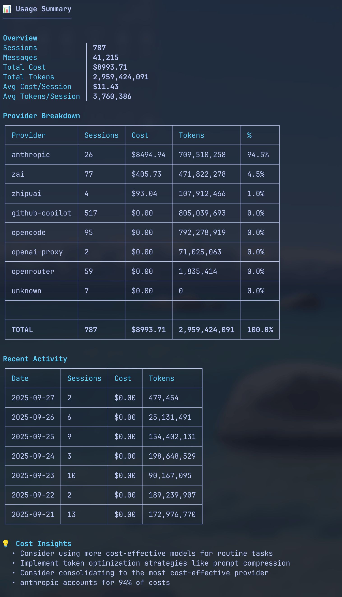
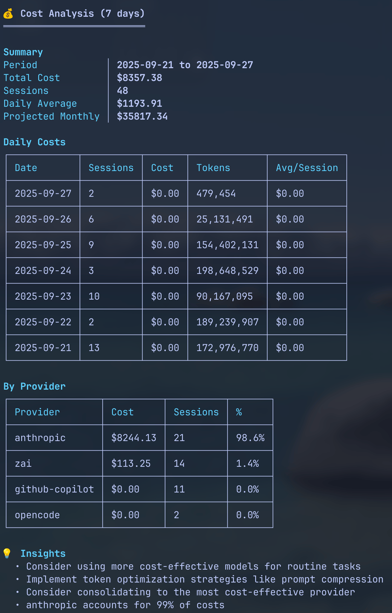
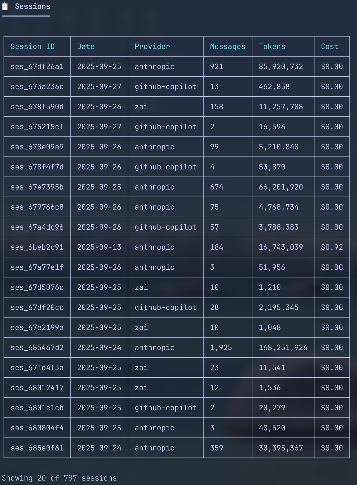
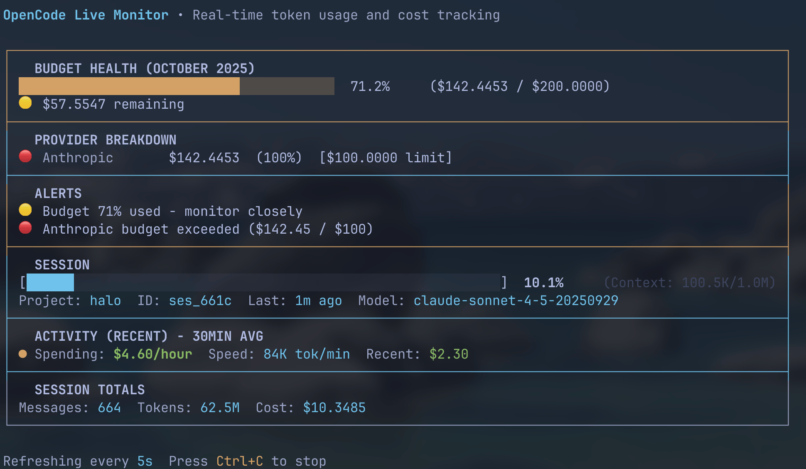
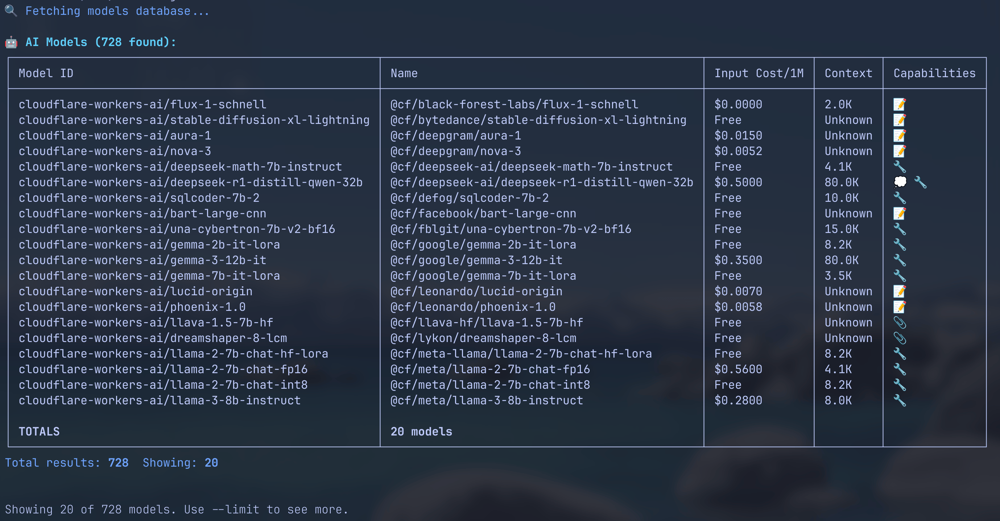

# OCsight - OpenCode Observability

Track OpenCode AI costs and usage. Real costs, real data. No estimates or projections.



## What It Does

**ocsight** reads your OpenCode session files and shows you:

- How much you're spending on AI models
- Which providers and models you're using
- Token usage and cost breakdowns
- Real-time monitoring of active sessions

## Installation

```bash
# macOS/Linux (Homebrew)
brew install heyhuynhgiabuu/tap/ocsight

# Node.js (npm)
npm install -g ocsight

# Direct download
curl -L https://github.com/heyhuynhgiabuu/ocsight/releases/latest/download/ocsight-$(uname -s)-$(uname -m).zip | tar -xz
```

## Quick Start

```bash
# See what you've spent
ocsight summary

# Track today's costs
ocsight costs today

# Monitor live session
ocsight live
```

## Screenshots & Examples

### 📊 Usage Summary

See your OpenCode usage at a glance with provider breakdowns and daily activity:


### 💰 Cost Tracking

Track your AI spending with daily breakdowns and spending alerts:



### 📋 Session Management

Browse, analyze, and drill into individual sessions:



### 🔴 Live Monitoring

Real-time dashboard showing active session metrics:



### 🤖 Model Database

Browse and compare pricing across 500+ AI models:



## Export Formats

ocsight can export your data in multiple formats for reporting and analysis:

### JSON Export

```json
{
  "summary": {
    "totalSessions": 787,
    "totalCost": 8736.43,
    "totalTokens": 2949563969,
    "dateRange": "2024-12-12 to 2024-12-19"
  },
  "providers": [
    {
      "name": "anthropic",
      "sessions": 26,
      "cost": 8237.66,
      "tokens": 699650136
    }
  ]
}
```

### CSV Export

```csv
Date,Provider,Model,Sessions,Tokens,Cost
2024-12-19,anthropic,claude-3.5-sonnet,15,12345678,234.56
2024-12-18,openai,gpt-4o,23,23456789,456.78
2024-12-17,anthropic,claude-3.5-haiku,19,18234567,345.67
```

### Markdown Report

```markdown
# OpenCode Usage Report

## Summary

- **Period**: 2024-12-12 to 2024-12-19
- **Total Sessions**: 787
- **Total Cost**: $8,736.43
- **Total Tokens**: 2,949,563,969

## Top Providers

| Provider  | Sessions | Cost      | Tokens      |
| --------- | -------- | --------- | ----------- |
| anthropic | 26       | $8,237.66 | 699,650,136 |
| openai    | 77       | $405.73   | 471,822,278 |
```

## Commands Reference

### `summary` - Usage Overview

```bash
ocsight summary                    # Last 7 days
ocsight summary --days 30          # Last month
ocsight summary --provider anthropic  # Filter by provider
ocsight summary --detailed          # Full breakdown
```

### `sessions` - Session Management

```bash
ocsight sessions list              # List all sessions
ocsight sessions list --recent     # Recent only
ocsight sessions show ses_123      # View specific session
ocsight sessions top --cost        # Most expensive sessions
ocsight sessions top --tokens      # Most tokens used
```

### `costs` - Cost Tracking

```bash
ocsight costs                      # Last 7 days
ocsight costs today                # Today only
ocsight costs --days 30            # Last month
ocsight costs --alert 100          # Alert if >$100/day
ocsight costs --provider anthropic # Filter by provider
```

### `live` - Real-time Monitoring

```bash
ocsight live                       # Monitor current session
ocsight live --session ses_123     # Monitor specific session
ocsight live --refresh 5           # Update every 5 seconds
```

### `export` - Export Data

```bash
ocsight export                     # JSON format
ocsight export --format csv        # CSV format
ocsight export --format markdown   # Markdown report
ocsight export --output report.csv # Custom filename
```

### `models` - Model Pricing

```bash
ocsight models list                # List all models
ocsight models providers           # List providers
ocsight models show gpt-4o         # Model details
```

## Example Terminal Output

```
📊 Usage Summary
════════════════

Overview
Sessions          │ 787
Total Cost        │ $8,736.43
Total Tokens      │ 2,949,563,969
Avg Cost/Session  │ $11.10

Provider Breakdown
┌──────────┬──────────┬──────────┬───────────────┐
│ Provider │ Sessions │ Cost     │ Tokens        │
├──────────┼──────────┼──────────┼───────────────┤
│ anthropic│      26  │ $8,237.66│ 699,650,136   │
│ openai   │      77  │   $405.73│ 471,822,278   │
│ github   │     517  │     $0.00│ 805,039,693   │
└──────────┴──────────┴──────────┴───────────────┘

Daily Activity (Last 7 Days)
┌────────────┬─────────┬──────────┬─────────────┐
│ Date       │ Sessions│ Cost     │ Tokens      │
├────────────┼─────────┼──────────┼─────────────┤
│ 2024-12-19 │      15 │   $234.56│  12,345,678 │
│ 2024-12-18 │      23 │   $456.78│  23,456,789 │
│ 2024-12-17 │      19 │   $345.67│  18,234,567 │
└────────────┴─────────┴──────────┴─────────────┘
```

## Why ocsight?

### ✅ Accurate

- **Real costs** from actual model pricing (models.dev)
- **Exact tokens** from OpenCode sessions
- **No estimates** or projections

### 🚀 Fast

- Optimized caching for large datasets
- Instant results after first run
- Handles 10k+ sessions efficiently

### 🎯 Focused

- Does one thing well: track AI costs
- No unnecessary features or complexity
- Clean, readable output

### 🔒 Private

- Runs entirely locally
- Never sends data anywhere
- Your usage stays on your machine

## Requirements

- Node.js 18+ or Bun
- OpenCode installed and configured
- Session data in `~/.local/share/opencode/storage/`

## Data Sources

ocsight reads from your local OpenCode storage:

```
~/.local/share/opencode/storage/
├── session/<project-hash>/ses_*.json   # Session metadata
└── message/<session-id>/msg_*.json     # Individual messages
```

## Development

```bash
# Clone repository
git clone https://github.com/heyhuynhgiabuu/ocsight
cd ocsight

# Install dependencies
bun install

# Build project
bun run build

# Run tests
bun test

# Run locally
node index.js summary
```

## Configuration

ocsight works out of the box with sensible defaults. Optional config:

```bash
# Initialize config
ocsight config init

# View current config
ocsight config show

# Validate setup
ocsight config doctor
```

## Troubleshooting

**No data showing?**

- Check OpenCode is installed: `which opencode`
- Verify data exists: `ls ~/.local/share/opencode/storage/`
- Run doctor: `ocsight config doctor`

**Wrong costs?**

- ocsight uses models.dev pricing
- Some providers (github) show $0.00 for free tiers
- Custom/enterprise pricing not supported

**Performance issues?**

- First run caches data (may be slow)
- Use `--days` flag to limit data range
- Large histories (>10k sessions) may be slow

## Project Structure

```
ocsight/
├── packages/
│   ├── cli/          # CLI implementation
│   └── web/          # Documentation website
├── assets/           # Screenshots and examples
├── scripts/          # Build and release scripts
└── README.md         # You are here
```

## Contributing

Contributions welcome! Please:

1. Fork the repository
2. Create a feature branch
3. Add tests for new features
4. Submit a pull request

## License

MIT © heyhuynhgiabuu

## Links

- [GitHub Repository](https://github.com/heyhuynhgiabuu/ocsight)
- [NPM Package](https://www.npmjs.com/package/ocsight)
- [Documentation](https://ocsight.com)
- [Issue Tracker](https://github.com/heyhuynhgiabuu/ocsight/issues)

---

**v1.0.0** · Track your AI costs with confidence · Built with simplicity and accuracy in mind
